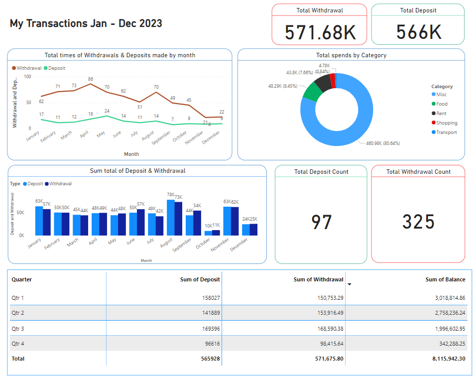
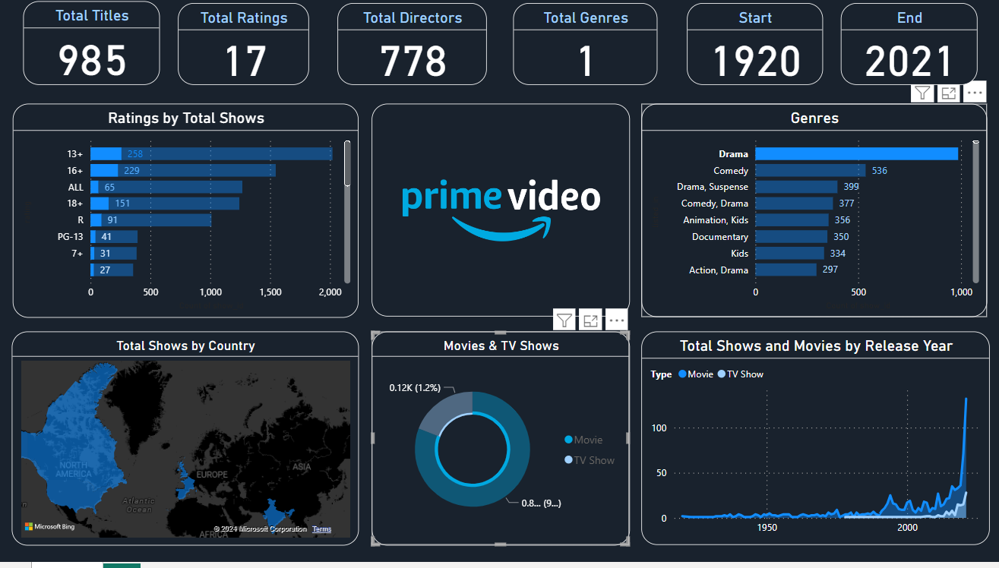

# Data Analyst

#### Technical Skills: Python, SQL, Java, JavaScript, HTML, CSS, ReactJS
#### Visualization: Microsoft Power Bi, Tableau, Looker
#### Database: MySQL, PostgreSQL
#### Soft Skills : Analytical Thinking, Presentation, Problem Solving, Active Listening, Adaptability.

## Education
- #### B.Tech,IT | Central Institute of Technology, Kokrajhar (2022)						       		
- #### XII,Science | Govt. Boys HS School, Dhubri (2016)	 			        		
- #### X | St. Agastya High School, Dhubri (2014)

## Work Experience
**Technical Consulting Engineer @ Cisco Systems India Pvt Ltd (_Oct 2022 - Oct 2023_)**
- Troubleshoot and diagnose the root cause of various hardware and software issues.
- Collaborated on cases related to OSPF, ISIS, and BGP.
- Demonstrated a basic understanding of MPLS, L2 and L3 VPN technologies.
- Utilized Cisco TAC Tools to streamline problem resolution.
- Executed upgrades or downgrades of XE and XR devices when required.
- Conducted lab tests to replicate and address defects’ root causes.

## Projects
### Personal Financial Insight
[View Project](https://github.com/BijitPika/My-transaction-dashboard)

During 2023, meticulously analyzed personal UPI transaction data extracted from HDFC bank statements. Leveraged **MS Excel** for meticulous data refinement, transformation, and categorization processes. Crafted an interactive **Power BI** dashboard to provide insightful visual representations of spending patterns. Shared the refined dataset on Kaggle for collaborative analysis within the community. Discovered significant insights into personal spending behaviors, contributing to informed financial decision-making.

### Amazon Prime Title Statistics Dashboard 
[View Project](https://github.com/BijitPika/Amazon-Prime-Power-Bi-Project)

Utilized **Power BI** to analyze the Amazon Prime titles dataset, focusing on visualization techniques. Conducted a geographical analysis to identify popular content regions. Engineered an interactive dashboard to facilitate user exploration and insight generation. Delivered actionable recommendations for optimizing content strategies based on insights gleaned from the analysis.

### Diwali Consumer Behaviour Analysis with Python
[View Project](https://github.com/BijitPika/Diwali-consumer-analysis-dataAnalysisPythonProject)

Undertook a thorough investigation into Diwali consumer behavior, employing Python as the principal analytical tool. Leveraging Python libraries, I proficiently processed and visualized data, ensuring precision and effectiveness throughout the analysis. By scrutinizing customer transactions during the Diwali festivities, I extracted valuable insights into consumer preferences, spending habits, and purchasing behaviors. These insights were translated into actionable recommendations aimed at refining sales and marketing strategies, tailored to maximize engagement and capitalize on opportunities during the festive season, thus facilitating informed decision-making and optimizing business performance.

## Acheivements
1. Developed and published the UPI Transactions Dataset on [Kaggle](https://www.kaggle.com/datasets/bijitda/upi-transactions-dataset), receiving recognition with a Bronze medal.
